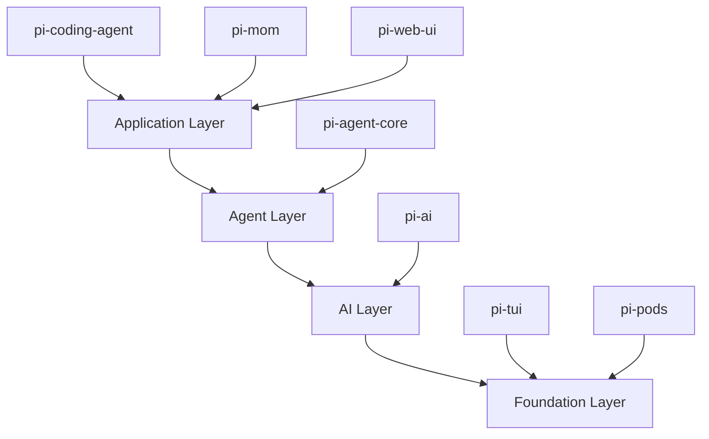

# Architecture Overview

The Pi toolkit is built as a layered monorepo architecture where each package provides specific capabilities that build upon lower-level packages. This design enables you to use Pi at different levels of abstraction depending on your needs.

## Architectural Layers

Pi's architecture is organized into four distinct layers:



### Foundation Layer

The foundation provides low-level primitives:

**pi-tui** - Terminal UI framework with differential rendering
- Component-based architecture
- Synchronized output for flicker-free updates
- Built-in components: Text, Editor, Markdown, Image, SelectList
- Theme support for customization
- Handles bracketed paste mode and autocomplete

**pi-pods** - GPU pod management for vLLM deployments
- CLI for deploying and managing LLM inference servers
- Handles GPU resource allocation
- Independent utility for self-hosted deployments

### AI Layer

**pi-ai** - Unified multi-provider LLM API
- Abstracts differences between OpenAI, Anthropic, Google, etc.
- Automatic model discovery with 50+ pre-configured models
- Streaming and non-streaming interfaces
- Tool calling (function calling) support
- Token and cost tracking
- Cross-provider context handoff
- OAuth provider support

<Tip>
pi-ai uses a **provider-agnostic** message format that enables seamless handoffs between different LLMs mid-conversation.
</Tip>

### Agent Layer

**pi-agent-core** - Stateful agent runtime
- Agent loop with tool execution
- Event-based architecture for streaming updates
- State management for conversations
- Message queue system for steering and follow-ups
- Abort handling and error recovery
- Custom message type support via declaration merging

The agent layer bridges the gap between raw LLM APIs and application-specific logic. It handles:
- Turn management (LLM call + tool executions)
- Tool result formatting
- Context transformation
- Streaming event emission

### Application Layer

Application-specific implementations built on the agent runtime:

**pi-coding-agent** - Terminal coding agent CLI
- Interactive TUI mode with editor
- Session management with branching
- Extension system
- Skills and prompt templates
- Built-in tools: read, write, edit, bash, grep, find
- Multiple output modes: interactive, print, JSON, RPC

**pi-mom** - Slack bot integration
- Delegates Slack messages to pi-coding-agent
- Manages multiple concurrent conversations
- Scheduled task execution
- Shared session management

**pi-web-ui** - Reusable web components
- Chat interface components
- Model selection UI
- Integration with pi-ai for browser-based apps
- Works with Lit or mini-lit

## Data Flow

### User Request Flow

```
┌─────────────┐
│   User      │
│   Input     │
└──────┬──────┘
       │
       ▼
┌─────────────────────────────────────────┐
│  pi-coding-agent                        │
│  - Parse input                          │
│  - Check for commands/templates         │
│  - Build context with session history   │
└──────┬──────────────────────────────────┘
       │
       ▼
┌─────────────────────────────────────────┐
│  pi-agent-core                          │
│  - Start agent loop                     │
│  - Transform context                    │
│  - Emit events (agent_start, turn_start)│
└──────┬──────────────────────────────────┘
       │
       ▼
┌─────────────────────────────────────────┐
│  pi-ai                                  │
│  - Convert messages to provider format  │
│  - Call LLM API                         │
│  - Parse streaming response             │
│  - Emit events (text_delta, tool_call)  │
└──────┬──────────────────────────────────┘
       │
       ▼
┌─────────────────────────────────────────┐
│  pi-agent-core                          │
│  - Collect tool calls                   │
│  - Execute tools                        │
│  - Add tool results to context          │
│  - Continue loop if needed              │
│  - Emit events (tool_execution_*, done) │
└──────┬──────────────────────────────────┘
       │
       ▼
┌─────────────────────────────────────────┐
│  pi-coding-agent                        │
│  - Update session                       │
│  - Render response in TUI               │
│  - Save session to disk                 │
└─────────────────────────────────────────┘
```

### Event Flow

The agent system is event-driven at every layer:

<CodeGroup>
```typescript pi-ai Events
// Streaming events from LLM
type AssistantMessageEvent =
  | { type: 'start' }
  | { type: 'text_delta', delta: string }
  | { type: 'tool_call_start' }
  | { type: 'tool_call_delta', delta: string }
  | { type: 'done', reason: StopReason }
```

```typescript pi-agent-core Events  
// Agent loop events
type AgentEvent =
  | { type: 'agent_start' }
  | { type: 'turn_start', turnIndex: number }
  | { type: 'message_start', message: AgentMessage }
  | { type: 'message_update', assistantMessageEvent }
  | { type: 'tool_execution_start', toolCallId, toolName }
  | { type: 'tool_execution_end', result }
  | { type: 'turn_end', message, toolResults }
  | { type: 'agent_end', messages }
```

```typescript pi-coding-agent Events
// Extension events (superset of agent events)
type ExtensionEvent =
  | AgentEvent
  | { type: 'session_start' }
  | { type: 'session_switch' }
  | { type: 'session_compact' }
  | { type: 'context', messages }
  | { type: 'input', text, source }
  | { type: 'model_select', model }
```
</CodeGroup>

## Package Dependencies

The dependency graph shows clear separation of concerns:

```
pi-coding-agent
├── pi-agent-core
│   └── pi-ai
├── pi-tui
└── jiti (for extension loading)

pi-mom
├── pi-coding-agent
├── pi-agent-core
└── pi-ai

pi-web-ui
├── pi-ai
├── pi-tui
└── mini-lit / lit

pi-pods
└── pi-agent-core
```

<Warning>
Packages are designed to be **loosely coupled**. pi-ai has zero dependencies on agent or coding-agent logic. pi-agent-core depends on pi-ai but knows nothing about the TUI or extensions.
</Warning>

## Extension Points

The architecture provides multiple extension points:

### At the AI Layer (pi-ai)
- Custom models with `Model<Api>` interface
- Provider registration for new LLM APIs
- Custom stream functions for proxy backends

### At the Agent Layer (pi-agent-core)
- Custom message types via declaration merging
- Tool registration with `AgentTool` interface
- Context transformation hooks
- Custom `convertToLlm` function

### At the Application Layer (pi-coding-agent)
- **Extensions**: TypeScript modules with full access to agent lifecycle
- **Skills**: Markdown files with instructions for specific tasks
- **Prompt Templates**: Reusable prompt snippets with argument substitution
- **Themes**: JSON-based UI customization

## Design Principles

### 1. Layered Abstraction

Each layer exposes a clean API that hides implementation details from layers above:
- pi-ai abstracts provider differences
- pi-agent-core abstracts the agent loop
- pi-coding-agent abstracts session management and UI

### 2. Event-Driven Architecture

All layers communicate via events:
- Enables streaming UIs
- Allows extensions to observe without blocking
- Supports multiple subscribers (extensions, logging, metrics)

### 3. Type Safety

TypeScript types flow through all layers:
- Model types enforce API compatibility
- Tool schemas use TypeBox for runtime validation
- Extension types ensure compile-time correctness

### 4. Composability

Packages can be used independently:
- Use pi-ai alone for LLM calls in any app
- Use pi-agent-core for custom agent implementations
- Use pi-tui for any terminal UI application
- Use pi-coding-agent as a library or CLI

## Next Steps

<CardGroup cols={2}>
  <Card title="Package Details" icon="box" href="/concepts/packages">
    Explore what each package provides
  </Card>
  
  <Card title="Extensibility" icon="puzzle-piece" href="/concepts/extensibility">
    Learn how to customize and extend Pi
  </Card>
</CardGroup>
