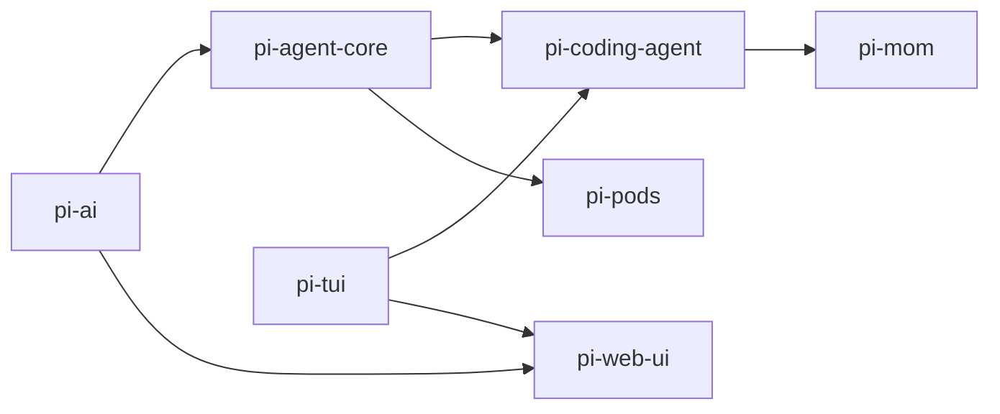

# Package Reference

The Pi monorepo contains seven npm packages, each serving a specific purpose. This guide provides detailed information about each package's capabilities, APIs, and use cases.

## Overview

| Package | Version | Purpose | Dependencies |
|---------|---------|---------|-------------|
| **pi-ai** | Unified LLM API | Multi-provider abstraction | None (self-contained) |
| **pi-agent-core** | Stateful agent runtime | Tool execution & state | pi-ai |
| **pi-tui** | Terminal UI framework | Rendering & input | None (self-contained) |
| **pi-coding-agent** | Coding agent CLI | Interactive coding assistant | pi-agent-core, pi-tui |
| **pi-mom** | Slack bot | Message delegation | pi-coding-agent |
| **pi-web-ui** | Web components | Browser chat UI | pi-ai, pi-tui |
| **pi-pods** | GPU pod manager | vLLM deployment | pi-agent-core |

---

## pi-ai

**Unified multi-provider LLM API with automatic model discovery**

### Key Features

- **Provider Support**: OpenAI, Anthropic, Google, Vertex AI, Mistral, Groq, Cerebras, xAI, OpenRouter, Bedrock, and more
- **50+ Pre-configured Models**: Automatically maintained model registry
- **Tool Calling**: TypeBox-based schemas with automatic validation
- **Streaming & Batched**: Both `stream()` and `complete()` interfaces
- **Token Tracking**: Automatic cost and usage calculation
- **Cross-Provider Handoff**: Continue conversations across different models
- **OAuth Providers**: Built-in support for Anthropic, OpenAI Codex, GitHub Copilot, Google Gemini CLI

### Core APIs

<CodeGroup>
```typescript Streaming
import { getModel, stream } from '@mariozechner/pi-ai';

const model = getModel('anthropic', 'claude-sonnet-4-20250514');
const s = stream(model, {
  messages: [{ role: 'user', content: 'Hello' }],
  tools: [myTool]
});

for await (const event of s) {
  if (event.type === 'text_delta') {
    process.stdout.write(event.delta);
  }
}

const finalMessage = await s.result();
```

```typescript Batched
import { getModel, complete } from '@mariozechner/pi-ai';

const model = getModel('openai', 'gpt-4o');
const response = await complete(model, {
  messages: [{ role: 'user', content: 'Hello' }]
});

console.log(response.content);
console.log(`Tokens: ${response.usage.input}/${response.usage.output}`);
```

```typescript Tools
import { Type, Tool } from '@mariozechner/pi-ai';

const weatherTool: Tool = {
  name: 'get_weather',
  description: 'Get weather for a location',
  parameters: Type.Object({
    location: Type.String({ description: 'City name' }),
    units: Type.Optional(Type.String())
  })
};
```
</CodeGroup>

### Provider Architecture

Each provider implements a standard stream interface:

```typescript
type ProviderStream = (
  model: Model<Api>,
  context: Context,
  options?: StreamOptions
) => AssistantMessageEventStream;
```

**Built-in APIs**:
- `anthropic-messages`: Anthropic Messages API
- `openai-completions`: OpenAI Chat Completions (used by Mistral, xAI, Groq, etc.)
- `openai-responses`: OpenAI Responses API  
- `google-generative-ai`: Google Gemini API
- `google-vertex`: Google Vertex AI
- `bedrock-converse-stream`: Amazon Bedrock

### Model Registry

Models are typed by their API:

```typescript
interface Model<TApi extends Api> {
  id: string;              // Model identifier
  name: string;            // Display name
  api: TApi;               // API type
  provider: string;        // Provider name
  baseUrl?: string;        // Custom endpoint
  reasoning: boolean;      // Supports thinking/reasoning
  input: ('text' | 'image')[]; // Supported inputs
  cost: {                  // Per-million-token costs
    input: number;
    output: number;
    cacheRead: number;
    cacheWrite: number;
  };
  contextWindow: number;   // Max tokens
  maxTokens: number;       // Max output tokens
  headers?: Record<string, string>; // Custom headers
}
```

Query models with full type safety:

```typescript
import { getProviders, getModels, getModel } from '@mariozechner/pi-ai';

const providers = getProviders(); // ['openai', 'anthropic', ...]
const models = getModels('anthropic'); // Model<'anthropic-messages'>[]
const model = getModel('openai', 'gpt-4o'); // Model<'openai-responses'>
```

<Tip>
The model registry is automatically regenerated during the build process by fetching the latest model data from providers.
</Tip>

---

## pi-agent-core

**Stateful agent with tool execution and streaming events**

### Key Features

- **Agent Loop**: Automatic turn management with tool execution
- **Event System**: Fine-grained events for streaming UIs
- **Message Queue**: Steering (interrupt) and follow-up messages
- **State Management**: Immutable conversation history
- **Custom Messages**: Declaration merging for app-specific message types
- **Abort Handling**: Graceful cancellation with partial results

### Core APIs

<CodeGroup>
```typescript Agent Class
import { Agent } from '@mariozechner/pi-agent-core';
import { getModel } from '@mariozechner/pi-ai';

const agent = new Agent({
  initialState: {
    systemPrompt: 'You are helpful',
    model: getModel('anthropic', 'claude-sonnet-4-20250514'),
    tools: [readTool, writeTool],
    messages: []
  }
});

// Subscribe to events
agent.subscribe((event) => {
  if (event.type === 'message_update') {
    console.log(event.assistantMessageEvent);
  }
});

// Send prompts
await agent.prompt('Hello');
```

```typescript Low-Level Loop
import { agentLoop, AgentContext } from '@mariozechner/pi-agent-core';

const context: AgentContext = {
  systemPrompt: 'You are helpful',
  messages: [],
  tools: [readTool]
};

const config = {
  model: getModel('openai', 'gpt-4o'),
  convertToLlm: (msgs) => msgs.filter(m => 
    ['user', 'assistant', 'toolResult'].includes(m.role)
  )
};

for await (const event of agentLoop(userMessages, context, config)) {
  console.log(event.type);
}
```
</CodeGroup>

### Event Flow

The agent emits a sequence of events during execution:

```
agent_start
  ├─ turn_start (turnIndex: 0)
  │   ├─ message_start (user message)
  │   ├─ message_end
  │   ├─ message_start (assistant message)
  │   ├─ message_update (streaming chunks)
  │   ├─ message_end
  │   ├─ tool_execution_start
  │   ├─ tool_execution_update (if tool streams)
  │   ├─ tool_execution_end
  │   └─ turn_end
  ├─ turn_start (turnIndex: 1)
  │   └─ ...
  └─ agent_end
```

### Tool Definition

Tools use TypeBox schemas for type-safe parameter validation:

```typescript
import { Type } from '@sinclair/typebox';
import type { AgentTool } from '@mariozechner/pi-agent-core';

const readFileTool: AgentTool = {
  name: 'read_file',
  label: 'Read File',
  description: 'Read a file from disk',
  parameters: Type.Object({
    path: Type.String({ description: 'File path' })
  }),
  
  execute: async (toolCallId, params, signal, onUpdate) => {
    // Stream progress updates
    onUpdate?.({ 
      content: [{ type: 'text', text: 'Reading...' }],
      details: {} 
    });
    
    const content = await fs.readFile(params.path, 'utf-8');
    
    return {
      content: [{ type: 'text', text: content }],
      details: { path: params.path, size: content.length }
    };
  }
};
```

### Message Queue System

**Steering** (interrupt current work):
```typescript
agent.setSteeringMode('one-at-a-time');
agent.steer({ role: 'user', content: 'Stop! Do this instead.' });
```

**Follow-up** (queue for after completion):
```typescript
agent.setFollowUpMode('one-at-a-time');
agent.followUp({ role: 'user', content: 'Also summarize the result.' });
```

---

## pi-tui

**Terminal UI framework with differential rendering**

### Key Features

- **Differential Rendering**: Three-strategy rendering (line-diff, box-diff, full)
- **Synchronized Output**: CSI 2026 for flicker-free updates
- **Component-Based**: Simple `render()` interface
- **Built-in Components**: Text, Editor, Markdown, Image, SelectList, Box
- **Theme Support**: Customizable styling via theme objects
- **Inline Images**: Kitty and iTerm2 graphics protocols
- **Bracketed Paste**: Handles large paste operations

### Core APIs

<CodeGroup>
```typescript Basic Usage
import { TUI, Text, ProcessTerminal } from '@mariozechner/pi-tui';

const terminal = new ProcessTerminal();
const tui = new TUI(terminal);

tui.addChild(new Text('Hello, world!'));
tui.start();
```

```typescript Editor
import { Editor } from '@mariozechner/pi-tui';

const editor = new Editor(tui, theme);
editor.onSubmit = (text) => {
  tui.addChild(new Text(`You said: ${text}`));
  editor.clear();
};

tui.addChild(editor);
```

```typescript Markdown
import { Markdown } from '@mariozechner/pi-tui';

const md = new Markdown(
  tui,
  '# Heading\n\nSome **bold** text',
  theme
);

tui.addChild(md);
```
</CodeGroup>

### Component Interface

All components implement a simple interface:

```typescript
interface Component {
  render(width: number): RenderResult;
  handleInput?(data: string): boolean;
  dispose?(): void;
}

interface RenderResult {
  lines: string[];
  cursorPosition?: { row: number; col: number };
}
```

### Rendering Strategies

1. **Line Diff**: Compare line-by-line, update only changed lines (default)
2. **Box Diff**: Send changed regions as rectangular boxes
3. **Full**: Redraw entire screen (fallback)

---

## pi-coding-agent

**Interactive terminal coding agent with extension system**

### Key Features

- **Four Modes**: Interactive (TUI), Print, JSON, RPC
- **Session Management**: Branching, compaction, tree navigation
- **Extension System**: TypeScript modules with lifecycle hooks
- **Skills**: Markdown-based task instructions
- **Prompt Templates**: Reusable prompts with arguments
- **Built-in Tools**: read, write, edit, bash, grep, find, ls
- **Context Files**: `.contextdocs`, `.context.md` support

### Session Architecture

Sessions are stored as JSON files with a tree structure:

```typescript
interface Session {
  entries: SessionEntry[];        // Flat list of all entries
  leafId: string | null;          // Current position in tree
  metadata?: {
    name?: string;                // Display name
    labels?: Record<string, string>; // Entry labels
  };
}

type SessionEntry =
  | MessageEntry                  // User/assistant/tool messages
  | BranchSummaryEntry            // Summarized branch
  | CompactionEntry               // Context compaction
  | CustomEntry;                  // Extension-defined
```

**Branching**: Each entry has a `parentId`, creating a tree. Navigate with `/tree`.

**Compaction**: When context exceeds limits, older messages are summarized into a `CompactionEntry`.

### Extension System

Extensions are TypeScript modules that receive an `ExtensionAPI`:

```typescript
import type { ExtensionAPI } from '@mariozechner/pi-coding-agent/hooks';

export default async (pi: ExtensionAPI) => {
  // Register event handlers
  pi.on('session_start', async (event, ctx) => {
    console.log('Session started');
  });
  
  // Register tools
  pi.registerTool({
    name: 'my_tool',
    description: 'Does something',
    parameters: Type.Object({ /* ... */ }),
    execute: async (id, params, signal, onUpdate) => {
      return { content: [{ type: 'text', text: 'Result' }] };
    }
  });
  
  // Register commands
  pi.registerCommand('mycommand', {
    description: 'Custom command',
    handler: async (args, ctx) => {
      await ctx.ui.notify('Command executed!');
    }
  });
};
```

**Extension locations**:
- Global: `~/.pi/agent/extensions/`
- Project: `.pi/extensions/`
- Explicit: `--extension path/to/extension.ts`

### Skills System

Skills are markdown files with frontmatter:

```markdown
---
name: python-debug
description: Debug Python code with detailed analysis
---

When debugging Python code:

1. Read the file and identify the error
2. Check for common issues (imports, syntax, logic)
3. Suggest fixes with explanations
```

The agent can load skills with `/skill python-debug` or they're auto-discovered and presented in the system prompt.

**Skill locations**:
- Global: `~/.pi/agent/skills/`
- Project: `.pi/skills/`
- Explicit: `--skill path/to/skill.md`

---

## pi-mom

**Slack bot that delegates messages to pi coding agent**

### Key Features

- Receives Slack messages via Socket Mode
- Spawns pi-coding-agent instances for each conversation
- Manages concurrent sessions
- Scheduled task execution with cron syntax
- Shared session pool for team collaboration

### Architecture

```typescript
// Mom delegates to pi via RPC mode
const pi = spawn('pi', ['--mode', 'rpc'], {
  stdio: ['pipe', 'pipe', 'inherit']
});

// Send messages
pi.stdin.write(JSON.stringify({
  type: 'prompt',
  content: slackMessage,
  sessionId: threadId
}));

// Receive responses
pi.stdout.on('data', (chunk) => {
  const response = JSON.parse(chunk);
  sendToSlack(response.content);
});
```

---

## pi-web-ui

**Reusable web components for AI chat interfaces**

### Key Features

- Built with mini-lit (Lit compatible)
- Chat message rendering
- Model selection dropdown
- Markdown and code highlighting
- File attachment support
- Integrates with pi-ai for browser usage

### Core Components

```typescript
import '@mariozechner/pi-web-ui';

<pi-chat-view
  .messages=${messages}
  .onSend=${handleSend}
  .model=${selectedModel}
></pi-chat-view>

<pi-model-selector
  .models=${availableModels}
  .selected=${selectedModel}
  .onChange=${handleModelChange}
></pi-model-selector>
```

---

## pi-pods

**CLI for managing vLLM deployments on GPU pods**

### Key Features

- Deploy LLM inference servers on GPU infrastructure
- Manage pod lifecycle (start, stop, scale)
- Monitor resource usage
- Configure model weights and parameters

### Usage

```bash
pi-pods create --model meta-llama/Llama-3-70b --gpu a100
pi-pods list
pi-pods logs <pod-id>
pi-pods delete <pod-id>
```

---

## Package Relationships

### Dependency Flow



### Shared Patterns

**Event-driven**: All packages emit events for extensibility

**TypeScript-first**: Full type safety across the stack

**Stream-based**: Designed for real-time streaming responses

**Composable**: Use packages independently or together

## Next Steps

<CardGroup cols={2}>
  <Card title="Architecture" icon="diagram-project" href="/concepts/architecture">
    Understand the overall system design
  </Card>
  
  <Card title="Extensibility" icon="puzzle-piece" href="/concepts/extensibility">
    Learn how to extend and customize
  </Card>
</CardGroup>
